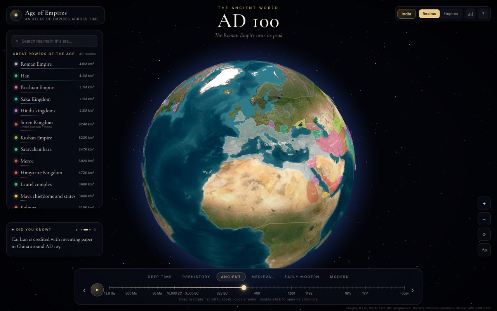
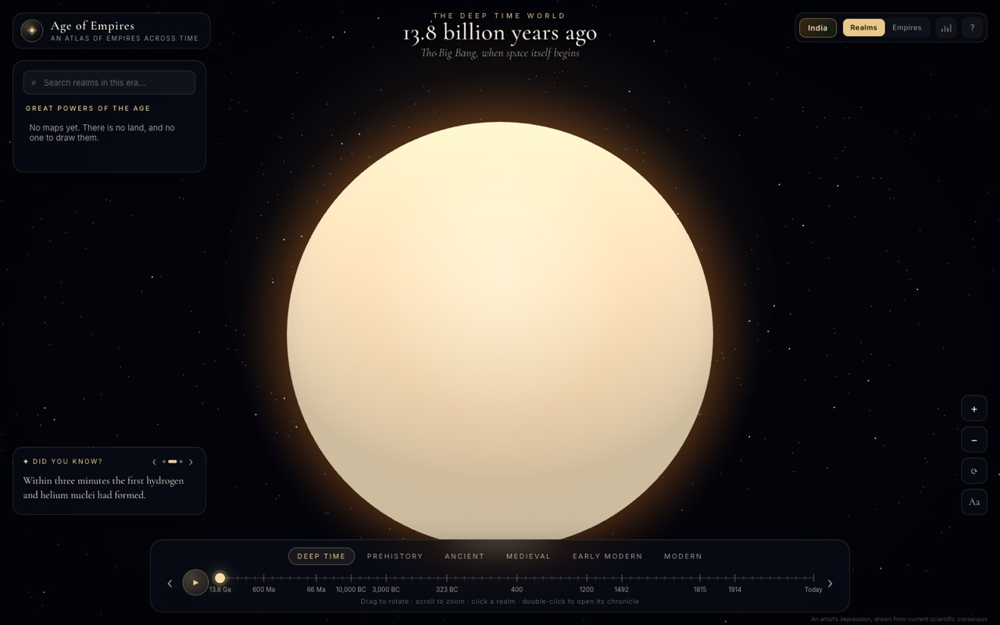
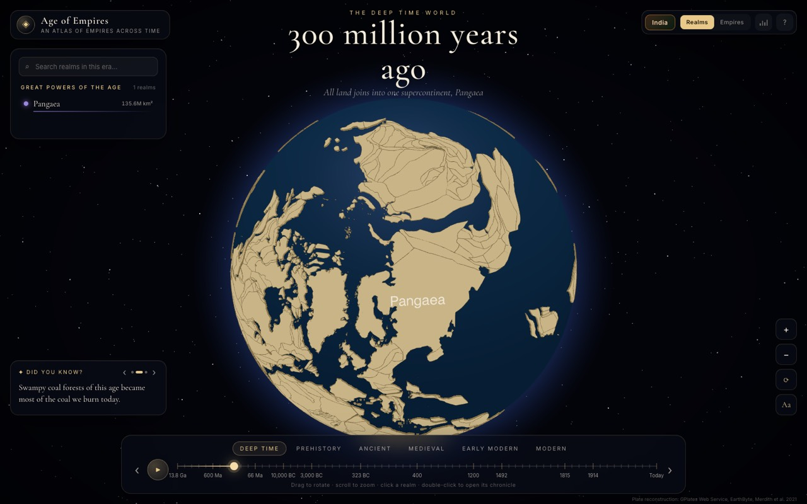
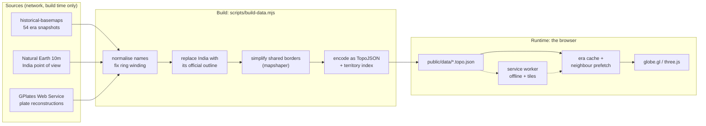
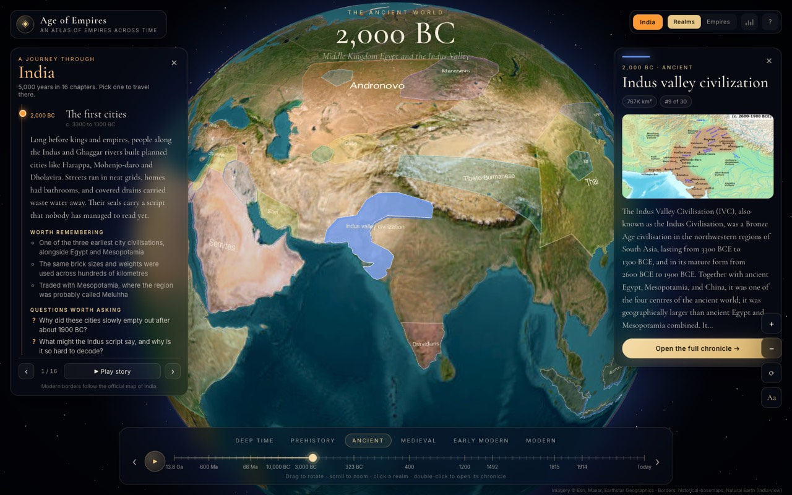
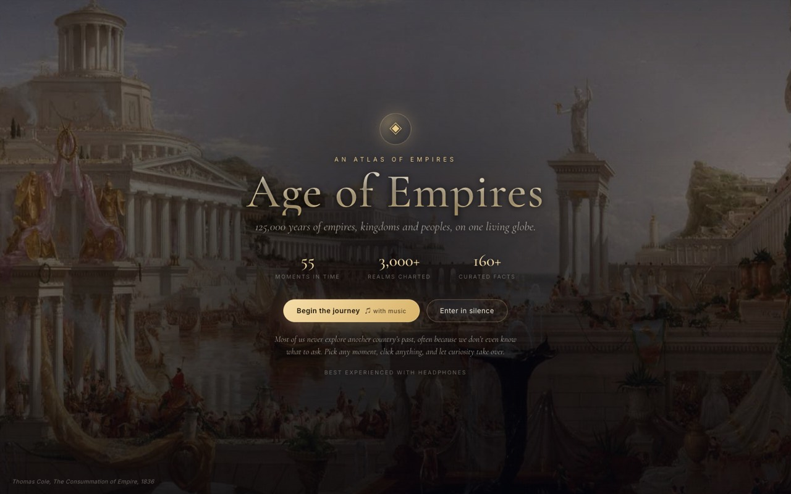

# Age of Empires

An interactive 3D globe of the whole past: the Big Bang, the birth of the Moon, Pangaea, and then
every empire, kingdom and people from the last interglacial to today. Drag the timeline and the
world redraws itself.



```
npm install
npm run dev      # http://localhost:5173
npm run build    # production build into dist/
npm run data     # rebuild every era's borders from source (slow, needs network)
npm run check    # assert India's official borders in every modern era
```

No API keys, no accounts, no backend. `npm run dev` is the whole setup.

---

## What it does

- **69 moments in time**, from 13.8 billion years ago to the present, on one timeline.
- **Real borders**, not drawings. Every historical era is a genuine dataset, and the deep-time
  continents come from published plate reconstructions.
- **Click any realm** for its territory over time, a Wikipedia chronicle, and a gallery.
- **A guided journey through India**, 5,000 years in 16 chapters, each with questions worth asking.
- **A generative score** that changes with the age you are looking at. Nothing is sampled; every
  note is synthesised in the browser.
- **Works offline** after the first visit, including eras you have not opened yet.

| | |
|---|---|
|  |  |
| 13.8 billion years ago | 300 million years ago |

---

## The shape of the problem

A globe that redraws the whole world every time you move a slider has one hard constraint: **the
moment the user drags, you must already have the data.** Historical border datasets are large,
messy GeoJSON, and there are 64 of them. Fetching and parsing one on demand takes seconds. Doing
that mid-drag would make the timeline feel broken.

Almost every decision below follows from that one constraint, and from a second: this had to stay
a static site with no server, so all the expensive work has to happen before the user arrives.

---

## Architecture

The system splits into three stages. The build stage runs on my machine and is allowed to be slow;
the runtime stage runs in the browser and is not allowed to be slow at all.



### Build time: `scripts/build-data.mjs`

One script turns three very different sources into one uniform format.

**Three sources, one shape.** Historical snapshots come from the
[historical-basemaps](https://github.com/aourednik/historical-basemaps) project. The modern world
comes from Natural Earth. Deep time comes from the GPlates Web Service, which returns reconstructed
coastlines for any moment in the last billion years. Each arrives with different properties, so the
script normalises everything down to three fields: a realm name, who it is a subject of, and what
it is part of. Everything downstream only knows about those three.

**Ring winding, the bug that eats continents.** GeoJSON polygons have an orientation, and d3 treats
a clockwise outer ring as *"the entire sphere except this shape"*. Many source polygons are wound
that way. Rendered naively, a country either vanishes or swallows the planet. `src/geo.js` measures
each polygon's spherical area and reverses any ring that covers more than half the sphere. It is
four lines of code and without it nothing works.

**Simplification has to be shared.** Every era is simplified to cut file size, but if you simplify
each country independently, neighbours that used to share a border drift apart and leave visible
gaps. `mapshaper` simplifies the *topology* instead, so a shared border is simplified once and both
sides keep matching. The rate is tuned per source: 60% of vertices kept for the historical
snapshots, 12% for the very detailed plate reconstructions, and 5% for the Natural Earth 10m file,
which is roughly twenty times more detailed than everything else.

**TopoJSON, not GeoJSON.** Because it stores shared borders once instead of twice, and quantises
coordinates to a grid, the encoded eras are a fraction of the size of the raw input.

**One extra artifact.** The script also writes `index.json`, mapping every realm name to its
territory in each era it existed. That single file is what powers the "territory across time"
chart in the chronicle, so opening a chronicle needs no extra requests.

### Runtime: loading without stalling

- **Two eras are already in flight before the app boots.** `index.html` preloads `index.json` and,
  via a tiny inline script that reads the URL hash, the first era's borders. They download in
  parallel with the JavaScript bundle rather than after it.
- **First paint comes before the heavy work.** Building hundreds of polygon meshes blocks a frame.
  The app waits for two animation frames so the page and the bare globe paint first, then builds
  the world.
- **Every era is cached as a promise**, not as data. The cache is populated the instant a request
  starts, so a user scrubbing quickly never fires the same request twice.
- **Neighbours are prefetched.** Loading era *i* also warms *i+1*, *i−1* and *i+2*, which is where
  the user is about to go.
- **Stale responses are dropped.** Each load takes a token; if the token has moved on by the time
  the response lands, it is discarded. Without this, scrubbing fast leaves you on the wrong map.
- **A service worker quietly fetches every remaining era** in the background, nearest first, two at
  a time. `requestIdleCallback` is useless here, because the globe renders every frame and the
  browser therefore never reports itself idle.

---

## Rendering the globe

### Why a tiled basemap instead of a texture

The obvious approach is one equirectangular Earth image on a sphere. That caps your detail: zoom in
and it turns to mush. Instead the globe uses a **slippy-map tile engine**, the same scheme web maps
use, projected onto the sphere. Tiles load only for the part you are looking at, and only at the
zoom level you need, so the surface stays sharp from orbit down to street level.

Getting this to look right took two attempts. Sentinel-2 satellite imagery is 10 m resolution and
beautiful up close, but at whole-globe zoom all that fine detail reads as noise: blown-out white
deserts and near-black oceans. Esri's World Imagery mosaic is blended for exactly this kind of view,
so that is what the globe uses. Sharpness then comes from three settings rather than from raw
resolution:

- **anisotropic filtering** on tile textures, so tiles stay crisp where the globe curves away from
  the camera and you are viewing them at a steep angle;
- **finer sphere geometry**, so the silhouette is round rather than faceted;
- **a low-resolution Earth beneath the tiles**, so tiles still streaming in never leave black holes.

### Drawing realms on a sphere

Realm polygons are extruded slightly off the surface. Three details make that work:

- **Smaller realms sit fractionally higher.** Overlapping polygons at identical altitude z-fight and
  flicker, and enclaves disappear behind the country enclosing them. Ranking realms by area and
  lifting the small ones by a hair fixes both.
- **Altitude scales with zoom.** Extrusion that looks right from orbit looks like a floating shelf
  up close, so the base altitude shrinks as you zoom in. It only recalculates when it changes by
  more than 25%, to avoid rebuilding every mesh on every scroll tick.
- **Colours are assigned with an awareness of neighbours.** Each realm has a preferred colour from a
  hash of its name, so it keeps that colour across eras. If a nearby realm already wears it, the
  next free colour in the palette is taken instead. Vassals are tinted toward their overlord, which
  is what the Realms / Empires toggle switches between.

### Deep time

Showing Pangaea over modern satellite imagery would be nonsense, so deep-time eras switch the
basemap off entirely and become a bare ocean-blue world with sand-coloured land. The data behind
them is real: reconstructed coastlines from the
[GPlates Web Service](https://gwsdoc.gplates.org/) using the Merdith et al. (2021) model, baked into
the same TopoJSON format as every other era at build time, so they load offline like the rest.

The service returns thousands of unnamed polygons, so each era labels all of its land with one
supercontinent name: Pannotia, Gondwana, Pangaea, Laurasia. That turns out to be an advantage,
because the name is a real Wikipedia topic, so clicking the land opens a proper chronicle.

The cosmic moments before that have no map at all. The Big Bang, the molten young Earth and the
Moon-forming impact are rendered as a coloured sphere and a glow, clearly an artist's impression,
labelled as such in the credits line.

### Small things that matter

- **The starfield is procedural.** A few thousand points placed on a sphere with a slight colour
  spread. It is sharper than a sky texture at any resolution and downloads nothing.
- **A CSS globe is painted instantly** behind the canvas, so there is something on screen before
  WebGL initialises.
- **Labels are excluded from pointer events**, otherwise a country's own name blocks clicks on it.

---

## India's borders

Maps published in India must show Jammu and Kashmir, Ladakh (including Aksai Chin) and Arunachal
Pradesh as Indian territory. Most open datasets do not.

Natural Earth ships point-of-view variants for exactly this reason, but only in its 10 m detail
tier, so the modern era uses that file and simplifies it much harder to match the others. For every
era from 1945 onward, the build script goes further: it replaces the snapshot's India with the
official outline and **erases that outline from every neighbour**, so there are no overlaps or
slivers along the new border. `npm run check` asserts that Gilgit, Muzaffarabad, Srinagar, Leh,
Aksai Chin, Siachen, Tawang and Itanagar each fall inside exactly one country, and that it is
India, while Lahore, Kathmandu and Dhaka still belong to their own.



---

## Content layers

**Chronicles come from Wikipedia at runtime**, which keeps the repository small and the text current.
Three problems had to be handled. Historical names are ambiguous, so "Rome" resolves to the Republic
or the Empire depending on the year you are viewing, and a hand-written override table catches the
rest. Article text is long, so it is split into sections and the most fact-like sentence is picked
from each, scoring sentences for superlatives, dates and notable verbs. And hovering a realm for
more than a moment quietly prefetches its chronicle, so the click feels instant.

**The music is generated, not played.** `src/audio.js` is a small Web Audio synthesiser: a drone,
slow filtered chord pads, band-passed noise for wind, and sparse bells with inharmonic partials.
Each age of history has its own scale and chord progression, and on the opening screen each painting
brings the musical tradition it belongs to, so the score shifts as the artwork changes. Because the
audio clock freezes while the tab is hidden, anything scheduled ahead would pile up and fire at once
on return, so playback is always checked against the context state.

**The opening artwork** is eight public-domain paintings from Wikimedia Commons, each credited on
screen, compressed to roughly 130 KB apiece.



---

## Performance

| Asset | Size | Gzipped |
|---|---|---|
| three.js | 1.38 MB | 365 KB |
| other vendor code | 568 KB | 186 KB |
| application code | 74 KB | 30 KB |
| styles | 35 KB | 8 KB |
| one era of borders | 100–750 KB | ~3× smaller |

three.js and the other libraries are split into their own chunks, because they change far less often
than the application code and can therefore stay in the browser cache across deploys. The dev and
preview servers gzip everything, since border data compresses roughly threefold.

The service worker keeps four separate caches with different policies: the app shell is served cache
first, era data and textures stale-while-revalidate, map tiles cache first with a 2,500 entry limit,
and Wikipedia responses with a 400 entry limit. The caches are versioned, so a new release drops the
old ones on activation.

---

## Trade-offs and limits

- **Deep time is not to scale.** The timeline positions eras by index, not by duration. At true
  scale, all of human history would occupy less than a pixel.
- **Every paleo era is one landmass.** GPlates returns unnamed polygons, so continents within an era
  cannot be told apart or clicked separately.
- **Borders are interpretations.** Historical frontiers were often zones rather than lines, and the
  source dataset makes choices that not every historian would make.
- **Esri's tile service needs no key but is not openly licensed** in the way the other sources are.
  It is used because its low-zoom mosaic is the only one that looks right at globe scale. The
  alternative, EOX Sentinel-2 under CC BY 4.0, is a one-line change.
- **Wikipedia is a runtime dependency.** Realm outlines, facts and the timeline all work offline;
  chronicles do not, until they have been opened once and cached.

---

## Layout

```
index.html              markup, font preloads, first-era preload
src/
  main.js               globe, timeline, selection, India panel, boot
  eras.js               all 69 eras: years, captions, facts, deep time
  data.js               TopoJSON to realms: areas, ranks, colours
  geo.js                ring winding, spherical area, name canonicalisation
  wiki.js               Wikipedia lookup, fact extraction, galleries
  chronicle.js          the full-screen chronicle and its territory chart
  india.js              the 16-chapter India journey
  audio.js              the generative score
  style.css             all styling
scripts/
  build-data.mjs        the build-time data pipeline
  check-borders.mjs     asserts India's official borders in the built data
public/data/            64 pre-built eras + the territory index
public/intro/           public-domain opening artwork
```

## Sources and licences

| What | Source | Licence |
|---|---|---|
| Historical borders | [historical-basemaps](https://github.com/aourednik/historical-basemaps) | CC BY 4.0 |
| Modern borders | [Natural Earth](https://www.naturalearthdata.com/) 10m, India point of view | Public domain |
| Plate reconstructions | [GPlates Web Service](https://gwsdoc.gplates.org/), Merdith et al. 2021 | CC BY 4.0 |
| Satellite imagery | Esri World Imagery, Maxar, Earthstar Geographics | Esri terms, no key required |
| Chronicles and galleries | Wikipedia and Wikimedia Commons | CC BY-SA |
| Opening artwork | Wikimedia Commons | Public domain |

Built with [globe.gl](https://github.com/vasturiano/globe.gl), [three.js](https://threejs.org/),
[d3-geo](https://github.com/d3/d3-geo), [topojson](https://github.com/topojson),
[mapshaper](https://github.com/mbloch/mapshaper) and [Vite](https://vitejs.dev/).
